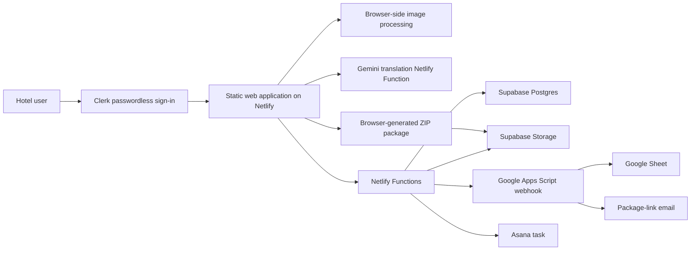

# Explorer Offers Collection Platform Architecture

> Current test mode: submissions create an Asana task and attach the selected images directly to it, then open a dedicated confirmation page. Supabase persistence, Google Sheets sync, ZIP generation, and package email are temporarily skipped.

## Overview

The application is a browser-first offer collection system for Pacific hotels. The primary deployment uses a static frontend hosted on Netlify, Netlify Functions for privileged server-side operations, Supabase for structured data and file storage, Google Apps Script for spreadsheet synchronisation and email delivery, and Asana for operational follow-up tasks.

## Primary deployment

The deployable application is contained in `deploy-github/`.

### Frontend

The frontend consists of `deploy-github/index.html`, `deploy-github/styles.css`, and `deploy-github/app.js`. Netlify publishes this directory as a static website.

The browser is responsible for:

- rendering the multilingual offer form;
- showing fields appropriate to each offer type;
- validating required content, dates, acknowledgements, and booking links;
- resizing uploaded marketing images;
- requesting and presenting draft translations;
- assembling submission data and file metadata;
- generating the final ZIP package; and
- downloading the ZIP locally and uploading it to Supabase Storage.

The supported offer types include Red Hot Rooms, More Escapes, hotel stays, dining, events, and partner offers. Offer-specific fields are stored together as a flexible JSON object.

### Authentication and authorization

`auth.js` loads Clerk, displays the passwordless sign-in screen, manages the browser session, and adds a short-lived Clerk bearer token to every sensitive function request. Only accounts with a verified primary email at exactly `accor.com` or `accorplus.com` are allowed into the form. The signed-in email is shown in the header, written into the read-only submitter-email field, and a logout control ends the session.

The browser check is for user experience only. Every sensitive Netlify Function calls the shared `_auth.js` guard, which verifies the Clerk session token, retrieves the verified primary email from Clerk, and repeats the exact-domain check. `submit-offer.js` replaces the email sent by the browser with this server-verified address. The public `auth-config.js` endpoint returns only Clerk's publishable key.

### Netlify Functions

The serverless functions in `deploy-github/netlify/functions/` keep privileged credentials out of the browser and expose the application operations.

| Function | Responsibility |
| --- | --- |
| `auth-config.js` | Returns Clerk's browser-safe publishable key. |
| `_auth.js` | Shared server-side session verification and Accor-domain authorization. |
| `submit-offer.js` | Creates a submission in Supabase, uploads supplied marketing assets, appends the offer to Google Sheets, and creates an Asana task. |
| `create-package-upload.js` | Creates a time-limited signed URL that lets the browser upload the generated ZIP directly to Supabase Storage. |
| `email-package.js` | Saves the ZIP metadata against the offer, updates the spreadsheet, and asks Apps Script to email the download link. |

Public offer IDs are derived from the Supabase numeric ID and formatted as `EXP-<year>-<six-digit ID>`, for example `EXP-2026-000123`.

### Supabase Postgres

The `offer_submissions` table is defined in `deploy-github/supabase-schema.sql`. It stores:

- submitter and hotel information;
- common offer content;
- offer-specific details as JSON;
- translations as JSON;
- file metadata and public URLs as JSON;
- confirmation and acknowledgement values;
- submission status; and
- creation and update timestamps.

Netlify Functions access Supabase with the service-role key. The browser does not receive that key.

### Supabase Storage

The default public bucket is `offer-assets`, configured by `deploy-github/supabase-storage-setup.sql`. Assets are grouped beneath the public offer ID.

Stored assets include:

- banner images;
- listing-tile images;
- social images; and
- generated ZIP packages.

Rate screenshots, menu PDFs, and booking screenshots are currently included in the downloaded ZIP but are not uploaded as separate storage objects.

### Google Sheets and email

`deploy-github/google-sheets-apps-script.js` is deployed as a Google Apps Script Web App. Netlify Functions call its webhook to:

- append a spreadsheet row when an offer is created;
- update the matching row by `offer_id` when an offer changes; and
- send an email containing the stored ZIP package link.

The ZIP is sent as a link instead of an attachment to avoid Netlify and Apps Script request-size limits.

### Asana

Immediately after Supabase creates the core record and assigns the public offer ID, `submit-offer.js` creates a task in the configured Asana project. This happens before image storage and spreadsheet synchronisation. The task title contains the offer ID and offer title. Its description contains the hotel or partner, submitter, booking link, offer content, offer-specific details, and terms. Image files and image links are intentionally excluded from the Asana task in the first iteration.

Asana task creation uses the official REST API from the Netlify Function, so the access token is never exposed to the browser. An optional assignee can be configured. If Asana is unavailable, the offer remains submitted and the confirmation panel displays a warning; this prevents a retry from creating a duplicate offer.

### Translation

The browser calls a Netlify Function backed by Gemini only when the user requests a translation preview. The chosen interface language is treated as the source language. Users can review and edit generated text before saving it into the submission package.

The translation integration should be privacy-reviewed before handling sensitive content.

## Submission flow

1. A hotel user signs in through Clerk with a verified `accor.com` or `accorplus.com` email.
2. The user completes the offer form and uploads the required assets.
3. The browser validates the form, resizes marketing images, and sends a Clerk session token.
4. The Netlify Function verifies the session and authorized email domain before processing the request.
5. `submit-offer` creates the database record and uploads selected marketing assets.
6. The function assigns the formatted public offer ID.
7. The function creates an Asana task for operational follow-up, without image links.
8. The function stores resized marketing images and synchronises the offer to Google Sheets.
9. The browser generates and downloads the ZIP package.
10. The browser requests a signed upload URL and uploads the ZIP directly to Supabase Storage.
11. `email-package` records the ZIP URL, refreshes the spreadsheet row, and triggers the package-link email.

## Configuration

The Netlify deployment uses these environment variables:

| Variable | Purpose |
| --- | --- |
| `CLERK_PUBLISHABLE_KEY` | Browser-safe Clerk application key used to initialize passwordless sign-in. |
| `CLERK_SECRET_KEY` | Server-only Clerk key used to verify sessions and retrieve the verified primary email. |
| `SUPABASE_URL` | Supabase project URL. |
| `SUPABASE_SERVICE_ROLE_KEY` | Privileged database and storage access used only by serverless functions. |
| `SUPABASE_STORAGE_BUCKET` | Optional storage bucket override; defaults to `offer-assets`. |
| `GOOGLE_SHEETS_WEBHOOK_URL` | Apps Script endpoint used for spreadsheet synchronisation and package email. |
| `ASANA_ACCESS_TOKEN` | Secret Asana personal access token or OAuth access token with task-write access. |
| `ASANA_PROJECT_GID` | Asana project in which new offer tasks are created. |
| `ASANA_ASSIGNEE_GID` | Optional Asana user to assign to every new offer task. |
| `GEMINI_API_KEY` | Gemini API key used server-side to align offer descriptions with the Explorer brand tone. |
| `GEMINI_MODEL` | Optional Gemini model override; defaults to `gemini-3.5-flash-lite`. |
| `TURNSTILE_SECRET_KEY` | Cloudflare Turnstile secret used by the submission function. |
| `TURNSTILE_ALLOWED_HOSTNAMES` | Optional comma-separated hostname allowlist; defaults to `hotelsoffer.netlify.app`. |

## Local and legacy implementation

The project root contains a lightweight Python server in `app.py`, a static application in `static/`, a SQLite database at `data/offers.db`, and local uploads under `data/uploads/`.

The Python server can serve the application locally and contains an older `/api/offers` SQLite backend. The current browser application and root `README.md` describe a no-backend/local packaging mode, while the more complete production architecture is the Netlify and Supabase implementation under `deploy-github/`.

The local Python/SQLite path should therefore be treated as a preview or legacy implementation, not the primary hosted architecture.
